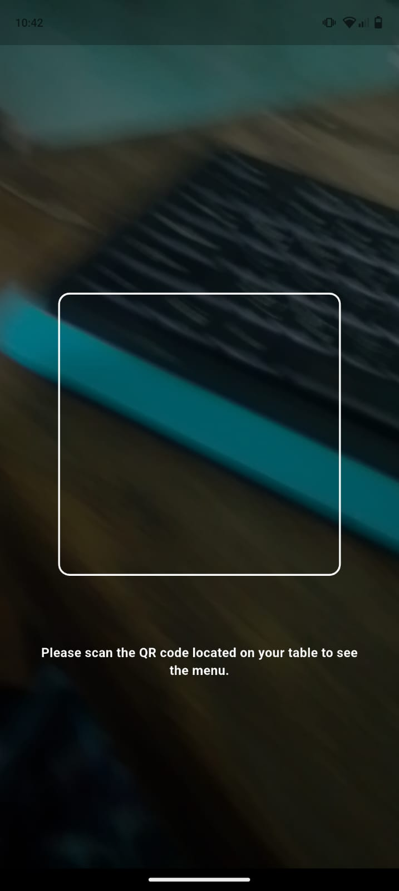
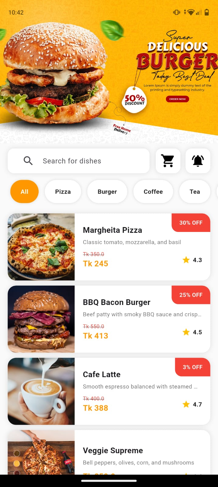
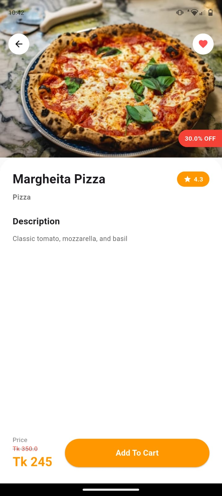
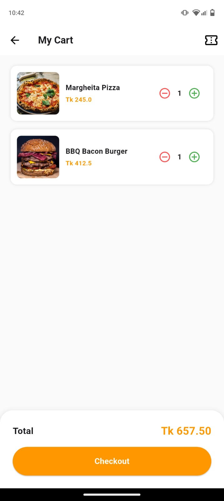
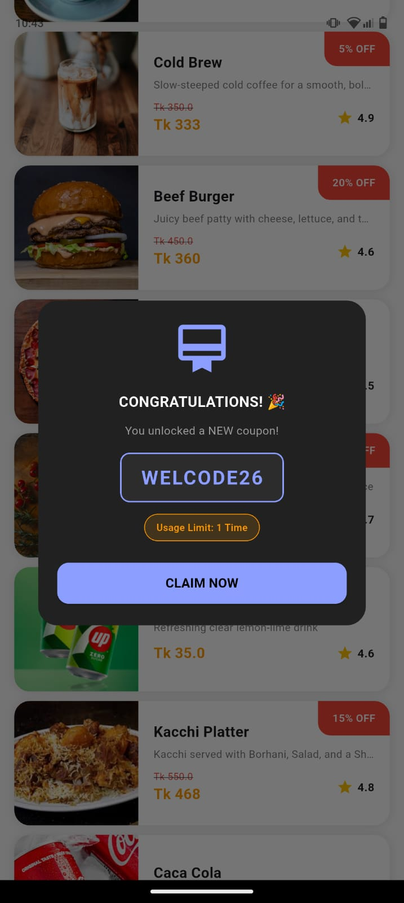
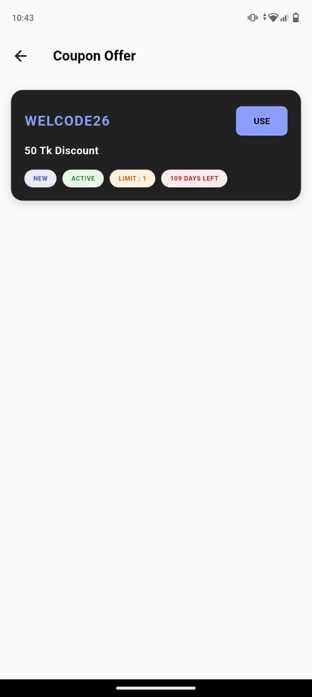
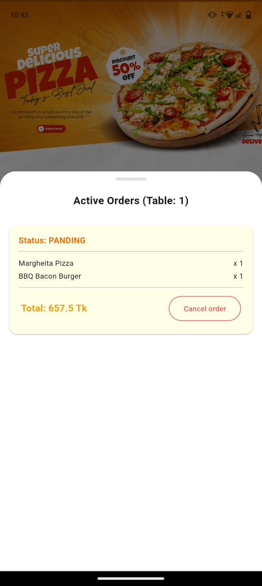

# 🍔 QR-Based Digital Menu & Ordering System

A smart digital dining solution that allows restaurant customers to scan table QR codes, browse menus, apply coupons, and place orders directly from their smartphones.

---

## 📱 App Screenshots & User Flow

### 1️⃣ QR Code Scanning
| Table QR Scanner |
| :---: |
|  |

**💡 Feature & Purpose:** 
- **QR Scanner:** Customers scan the unique QR code placed on their dining table to instantly open the digital menu with table-specific session tracking.

---

### 2️⃣ Menu Browsing & Item Details
| Digital Menu (Home) | Food Details & Offer |
| :---: | :---: |
|  |  |

**💡 Feature & Purpose:**
- **Digital Menu:** Displays categorized food items (Pizza, Burger, Coffee, etc.), promotional banners with discounts, and item ratings.
- **Item Details Screen:** Shows full dish description, calorie/rating info, discounted pricing, and a quick **"Add To Cart"** option.

---

### 3️⃣ Cart & Order Checkout
| My Cart Screen |
| :---: |
|  |

**💡 Feature & Purpose:**
- **My Cart:** Allows users to review selected items, adjust quantities (+/-), view total bill calculation, and proceed to checkout with a single tap.

---

### 4️⃣ Rewards & Coupons
| Coupon Unlocked | My Coupons |
| :---: | :---: |
|  |  |

**💡 Feature & Purpose:**
- **Reward Popup:** Interactive pop-up congratulating users when unlocking new promotional discount codes.
- **Coupon Offer:** Displays active discount codes (e.g., `WELCODE26`), validity period, and direct "USE" option for instant savings.

---

### 5️⃣ Live Order Tracking
| Active Orders (Table Specific) |
| :---: |
|  |

**💡 Feature & Purpose:**
- **Active Orders:** Displays real-time order status (e.g., *Pending/Preparing*), table number identification (e.g., *Table: 1*), ordered item list, total amount, and an option to cancel the order.
